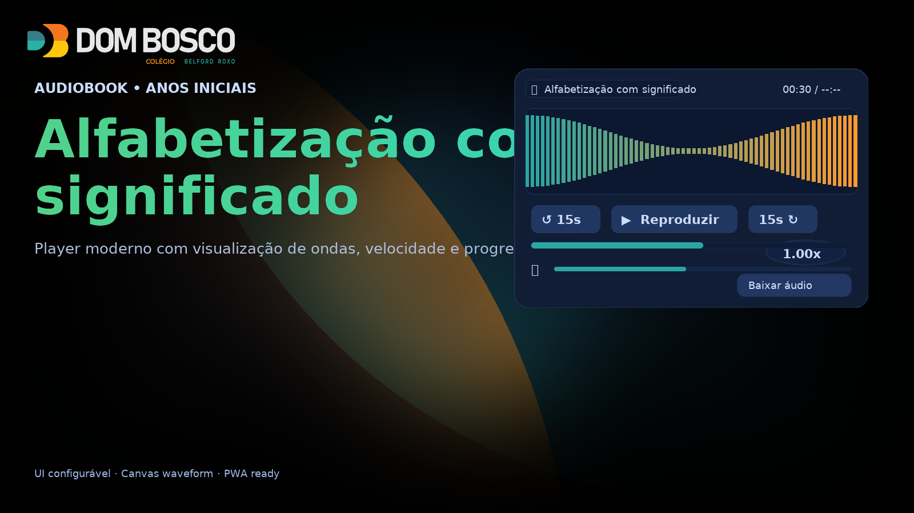

# Audiobooks — Colégio Dom Bosco RJ

Player de audiobook moderno, responsivo e acessível, com visualizador de ondas (Canvas), controle de velocidade, salvamento de progresso e integração opcional com Spotify.  
Todo o conteúdo da página é **configurável** via `assets/config/app.config.json` (ou `assets/config/env.js` para overrides locais).



---

## ✨ Principais recursos

- 🎧 **Player** com play/pause, pular ±15s, velocidade configurável (0.75×–1.5×)
- 🌊 **Waveform** em Canvas com **detector de pico** e animação antes do play
- 💾 **Salva progresso** de escuta no `localStorage`
- 🔉 **Controle de volume** e atalho de teclado (barra de espaço, setas)
- 📱 **Layout responsivo** (mobile/desktop)
- 🔗 **Links configuráveis** (Spotify, CTA de Matrículas, contatos)
- 🧩 **SEO/OG/Twitter** preenchidos a partir do config
- 🗂️ **Multi-página**: cada página pode ter seu próprio `app.config.json`

---

## 📁 Estrutura

```
📦raiz
├──📁 assets/
│ ├──📁 audio/
│ ├──📁 config/
│ │ ├──📜 app.config.json # Configuração da página
│ │ └──📜 env.js # (opcional) overrides locais
│ ├─📁 css/
│ │ └──📜 styles.css
│ ├─📁 img/
│ │ └──📜 logo-colegio-db-neg.png
│ │ ├──📜 logo-colegio-db-neg.webp
│ │ └──📜 logo-colegio-db-neg.avif
│ └──📁 js/
│ └──📜 app.js
├──📜 index.html
├──📜 sw.js # (opcional) service worker simples
└──📜 manifest.webmanifest # (opcional) PWA metadata
```

---

## ⚙️ Configuração (app.config.json)

Exemplo:

```json
{
  "siteBaseUrl": "https://plataforma.domboscorj.com.br/",
  "audio": "assets/audio/fund1-alfabetizacao_com_significado.mp3",
  "seo": {
    "title": "Alfabetização com significado — Dom Bosco RJ",
    "description": "Audiobook: Alfabetização com significado — Ler e escrever com prazer. Colégio Dom Bosco RJ.",
    "image": "assets/img/logo-colegio-db.png",
    "canonical": "https://plataforma.domboscorj.com.br/audiobook/"
  },
  "ui": {
    "kicker": "Audiobook • Anos Iniciais",
    "pageTitle": "Alfabetização com significado",
    "pageSubtitle": "Ler e escrever com prazer",
    "lead": "A alfabetização com significado desperta a imaginação, conecta letras à vida real e, desde já, abre caminho para o futuro.",
    "trackTitle": "Alfabetização com significado",
    "download": "assets/audio/fund1-alfabetizacao_com_significado.mp3",
    "sectionTitle": "Sobre o aprendizado",
    "articles": [
      { "title": "🟢 A leitura que desperta", "text": "..." },
      { "title": "🟢 A ciência do aprender", "text": "..." },
      { "title": "🟢 O futuro começa agora", "text": "..." }
    ]
  },
  "links": {
    "spotify": "https://open.spotify.com/episode/...",
    "cta": "https://domboscorj.com.br/contato",
    "phone": "tel:+552141090710",
    "whatsapp": "https://wa.me/5521989886632",
    "email": "mailto:contato@domboscorj.com.br"
  }
}
```

Para overrides locais, crie assets/config/env.js com:

```
window.APP_ENV = {
  audio: "assets/audio/outro-episodio.mp3",
  ui: { pageTitle: "Outro título" }
};
```

---

## ➕ Como criar uma nova página/episódio

- Duplique index.html para pagina2.html (por exemplo).

- Crie um assets/config/app.config.json específico nessa nova pasta/página (ou use o mesmo caminho, conforme sua estrutura).

- Ajuste os campos audio, ui._, links._ e seo.\* para o novo episódio.

- Publique (GitHub Pages, servidor estático etc).

Dica: mantenha o mesmo HTML base; a página será preenchida dinamicamente a partir do app.config.json.

---

## 🚀 Rodando localmente

Use qualquer servidor estático (ex.: VS Code Live Server ou npx serve).

Abra http://localhost:PORT/.

---

## 📦 Deploy

GitHub Pages: ative Pages no repositório (branch main, pasta /root).

Ou suba para qualquer hosting estático (Netlify, Vercel, S3, nginx, etc.).

---

## 📝 Licença

Uso interno do Colégio Dom Bosco RJ.
